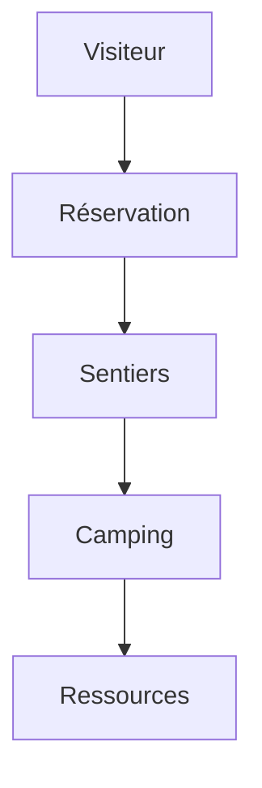

# 🌿 Parc National des Calanques – Marseille

## 📌 Présentation
Ce projet vise à gérer et valoriser le **Parc National des Calanques de Marseille** :  
- Gestion des visiteurs  
- Suivi des sentiers et zones protégées  
- Organisation des campings et hébergements  
- Préservation des ressources naturelles  

## 🗺️ Diagramme Mermaid


---

## État du projet (30/09/2025)

### Backend
- Modèles CRUD réalisés pour :
  - User, Visiteur, Camping, Notification, RessourceNaturelle, CarteMembre, Sentier, Reservation
- Harmonisation et correction des endpoints (public/admin/visiteur/auth)
- Correction des inclusions et conflits de classe Database
- Sécurisation des endpoints admin par token JWT
- Création et correction des scripts de test d’intégration (REST Client)
- Tests unitaires complets et **tous passés** (PHPUnit)
- Authentification et flux utilisateur testés
- Scripts SQL corrigés et importés
- APIs/contrôleurs présents pour :
  - camping.php
  - sentier.php
  - reservation.php
  - notification.php
  - ressource_naturelle.php
  - carte_membre.php
  - visiteur.php
  - utilisateur.php

### Frontend
- Projet React/Vite (dossier `frontend`)
- Build réussi (`npm run build`)
- À vérifier : intégration complète avec les APIs backend

### Tests
- Tous les tests backend passent (42 tests, 118 assertions)
- Création et correction des tests d’intégration pour les endpoints principaux
- À compléter : tests d’intégration supplémentaires, tests frontend

---

## TODO LISTE

### Backend
- [ ] Compléter les API/contrôleurs pour toutes les entités
- [ ] Ajouter des tests d’intégration pour les flux complexes
- [ ] Vérifier la cohérence des routes et la sécurité

### Frontend
- [ ] Vérifier l’intégration avec le backend (appels API, affichage)
- [ ] Ajouter des tests frontend si besoin

### Documentation
- [ ] Documenter chaque endpoint/API
- [ ] Ajouter des exemples d’utilisation (requêtes, réponses)
- [ ] Mettre à jour cette liste au fil de l’avancement

---

## Commandes utiles

### Lancer les tests backend
```sh
cd backend
php vendor\bin\phpunit --testdox
```

### Builder le frontend
```sh
cd frontend
npm run build
```

### Lancer le frontend en mode dev
```sh
cd frontend
npm run dev
```

---

## Points de vigilance
- Bien vérifier la structure SQL avant de lancer les tests
- Toujours relancer les tests après une fusion de branche
- Documenter chaque nouvelle fonctionnalité ou correction

---

## À faire prochainement
- Finaliser toutes les APIs
- Ajouter des tests d’intégration et frontend
- Vérifier la cohérence globale (back + front)
- Mettre à jour la documentation technique
